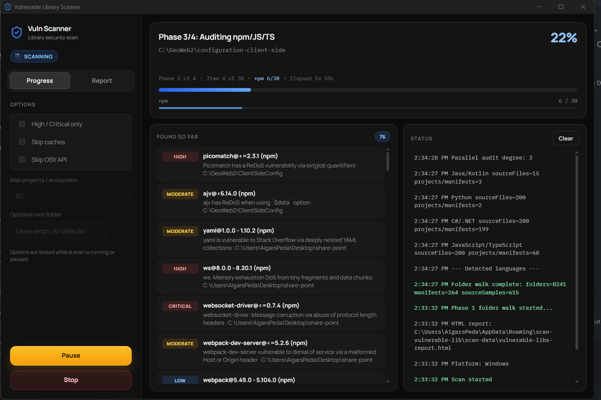
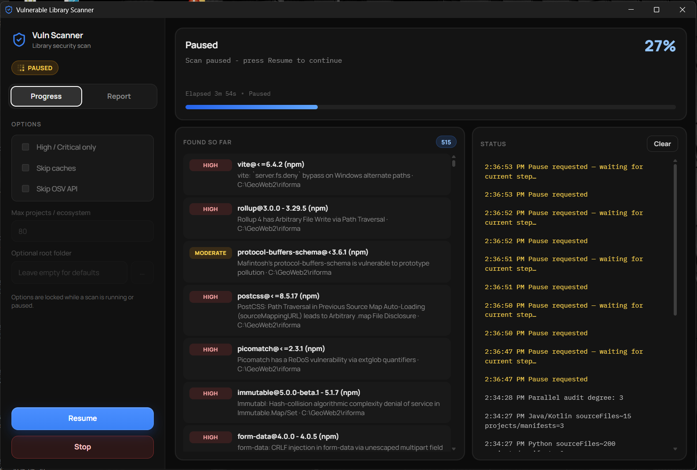
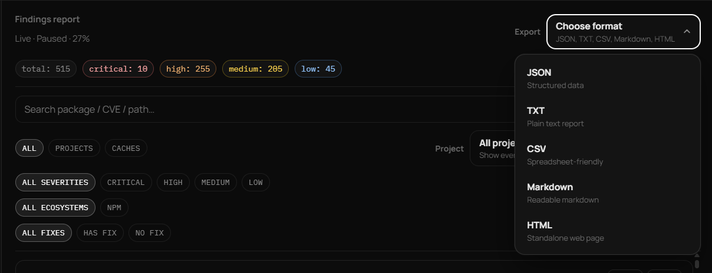

# Vulnerable Library Scanner

**Desktop dependency vulnerability scanner for Windows and macOS.** Find insecure libraries across npm, NuGet, PyPI, Go, Rust, PHP, and more — with a live Electron GUI, OSV-backed checks, and exportable reports.

If you are searching for a **vulnerable library scanner**, **dependency vulnerability scanner**, **software composition analysis (SCA)** tool, or a desktop alternative to running `npm audit` / `dotnet list package --vulnerable` by hand, this project is built for that workflow.

---

## Why this exists

Modern machines often hold dozens of projects and language ecosystems. Checking them one by one is slow and easy to miss. This app:

1. Discovers projects and package managers on disk  
2. Runs native audits when available (`npm audit`, `dotnet`, `pip-audit`, …)  
3. Falls back to the [OSV](https://osv.dev/) API for packages without a local auditor  
4. Streams findings into a live Report you can filter and export  

---

## Download installers

| Platform | Installer |
|----------|-----------|
| **Windows** | `Vuln Scanner-*-Windows-Setup-x64.exe` (NSIS) and `Vuln Scanner-*-Windows-Portable-x64.exe` from [Releases](https://github.com/AigarsPeda/scan-vulnerable-lib/releases) |
| **macOS** | DMG / ZIP from [Releases](https://github.com/AigarsPeda/scan-vulnerable-lib/releases) (build on a Mac or CI) |

> After cloning, you can also build locally (see [Build installers](#build-installers)).

### Runtime requirements

- **Windows / macOS:** just the app — the scanner runs on Electron’s built-in Node (no PowerShell install)
- Optional tools improve coverage: Node.js/`npm`, .NET SDK, `pip-audit`, `govulncheck`, `cargo audit`, Composer, etc. Without them, OSV API fallback still works for many ecosystems.

---

## Features

- **Multi-language scanning** — JavaScript/TypeScript (npm/yarn), .NET (NuGet), Python (PyPI), Go, Rust, PHP, Ruby, Java/Maven, Dart, Swift, Scala  
- **Live Progress** — percent, phase, per-ecosystem counters, elapsed time, streaming findings  
- **Native Report tab** — filter by severity, project/cache, ecosystem, has-fix; Open / Copy path  
- **Exports** — JSON, TXT, CSV, Markdown, HTML  
- **Controls** — Start / Pause / Resume / Stop; options locked while scanning  
- **Performance** — OSV cache + `/v1/querybatch`, skip redundant OSV after native audits, finding dedupe, command timeouts 

---

## Screenshots

### Live Progress



Scan in progress: phase/percent, per-ecosystem counters, live findings, and status log.

### Pause / Resume



Pause a long scan and resume when ready. Options stay locked while a run is active.

### Findings Report & Export



Filter by severity, project, ecosystem, and fix availability. Export as JSON, TXT, CSV, Markdown, or HTML.

---

## Build installers

```bash
git clone https://github.com/AigarsPeda/scan-vulnerable-lib.git
cd scan-vulnerable-lib
npm install
```

| Command | Result |
|---------|--------|
| `npm run dist:win` | Windows NSIS + portable under `release/` |
| `npm run dist:mac` | macOS DMG + ZIP under `release/` (run on macOS) |
| `npm run dist` | Build for the current platform |
| `npm run dist:dir` | Unpacked app folder (fast smoke test, no installer) |

Installers and portable builds land in the `release/` folder.

### Development

```bash
npm run dev        # hot reload
npm run build      # compile Electron main/preload/renderer
npm start          # preview production build
npm run typecheck
```

---

## How to use

1. Install / run the app  
2. Optionally set a **root folder** (recommended — limits scan scope)  
3. Adjust options (High/Critical only, skip caches, skip OSV, max projects)  
4. Click **Start** — watch Progress, open **Report** when the green indicator appears  
5. Export the format you need  

### Options

| Option | Meaning |
|--------|---------|
| High / Critical only | Passes `-HighOnly` |
| Skip caches | Passes `-SkipCache` |
| Skip OSV API | Passes `-SkipOsv` |
| Max projects / ecosystem | Passes `-MaxProjectsPerEco` (default 80) |
| Optional root folder | Passes `-Drive` — strongly recommended for focused scans |

Working files (`findings.json`, progress, etc.) live in the Electron **app data** folder.

---

## Who is this for?

- Developers auditing **local machines** or shared project roots  
- Security-minded teams doing light **SCA / dependency vulnerability** checks  
- Anyone who wants a **GUI vulnerable package scanner** instead of juggling CLI tools per language  

Not a replacement for enterprise SCA platforms — it is a practical desktop scanner for multi-language workstations and project folders.

---

## Project layout

```
scan-vulnerable-lib/
  electron/main/       # Electron main process
  electron/preload/    # Secure preload bridge
  electron/scanner/    # Node vulnerability scanner (Win + macOS)
  src/                 # React + TypeScript UI
  scripts/             # Legacy PowerShell scanner (reference only)
  assets/              # App icons
  electron-builder.yml # Installer packaging
  release/             # Built installers (after npm run dist:*)
```

The Node scanner is packaged inside the app and needs no extra runtime on Windows or macOS.

---

## Keywords

`vulnerable library scanner` · `dependency vulnerability scanner` · `OSV scanner` · `npm audit GUI` · `NuGet vulnerability` · `PyPI security scan` · `software composition analysis` · `SCA desktop` · `CVE dependency check` · `supply chain security`

---

## License

MIT — see [LICENSE](LICENSE).

## Contributing / issues

Bug reports and ideas: [GitHub Issues](https://github.com/AigarsPeda/scan-vulnerable-lib/issues).

If this helps you, starring the repo and sharing release links makes it easier for others to find a **desktop vulnerable dependency scanner** for Windows and Mac.
